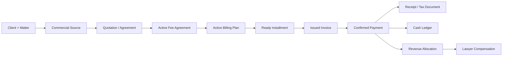
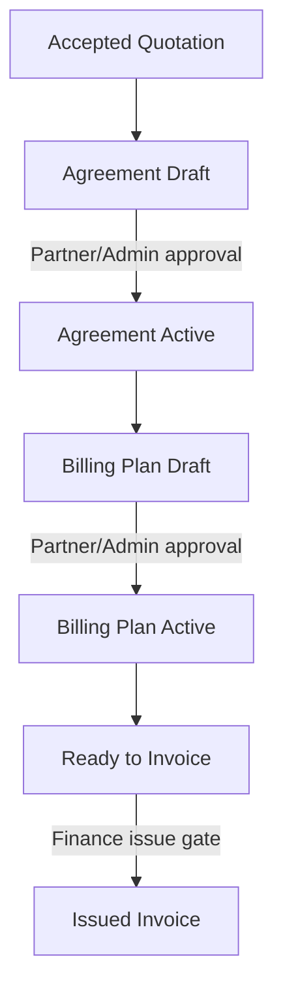
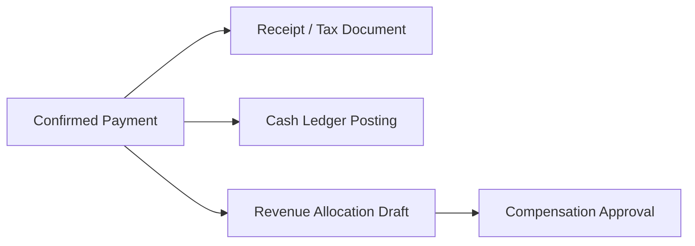

# VP Commercial-to-Accounting Workflow

VP Office Operating System — Operational Finance Standard v1

## 1. Actors and Responsibilities

Business responsibilities do not yet imply separate application roles. Current finance-document access is admin/partner; future permission design must map these responsibilities explicitly.

| Actor | Draft / review | Approve / issue / post | Reverse / internal notes |
|---|---|---|---|
| Admin | all finance drafts | operational fallback approver | controlled reversal; internal notes |
| Partner | commercial review, plan review | agreement/plan approval within policy | controlled cancellation; internal notes |
| Matter Owner | proposes scope, milestone, readiness | confirms matter facts | views assigned matter notes only |
| Billing Administrator | prepares agreements, plans, invoices | submits for issue | no unilateral tax/cash reversal |
| Finance Approver | reviews cash/ledger/allocation | posts approved cash flow | authorizes ledger reversal |
| Accountant / Tax Reviewer | reviews VAT/WHT/tax identity | approves tax-document treatment | void/replacement review |
| Authorized Signer | reviews client-facing terms | signs/authorizes document where required | no automatic financial post |
| Compensation Approver | reviews allocation/payables | approves compensation | controlled reversal |
| System Automation | proposes/drafts/reminds | never legally issues/posts | no destructive reversal |
| Future AI Assistant | suggests, classifies, drafts | never confirms legal/financial facts | no direct mutation |

## 2. Canonical Operational Workflow

| # | Trigger / owner | System and human action | Entity/status change | Document / snapshot / audit | Reversal |
|---|---|---|---|---|---|
| 1 | Admin/Matter Owner | create Client and Case/Advisory | client/matter created | none; audit create | normal data correction |
| 2 | Matter Owner | choose commercial source | source selected | source reason audit | replace draft selection |
| 3 | Billing/Admin | draft, send, accept Quotation | quotation draft→sent→accepted | quotation snapshot; client document | cancel, never edit accepted |
| 4 | Billing | create Fee Agreement Draft | agreement draft | source snapshot/audit | edit draft |
| 5 | Partner | review commercial terms | draft remains draft | review audit | revise draft |
| 6 | Partner/Admin | activate Agreement | draft→active | freeze terms/items/allocation snapshot | controlled cancel |
| 7 | Billing | create Billing Plan Draft | plan draft | schedule audit | replace via draft RPC |
| 8 | Billing/Matter Owner | define installments/allocation | plan draft | VAT/allocation validation audit | replace draft |
| 9 | Partner/Admin | activate Plan | draft→active | freeze schedule | controlled cancel |
| 10 | system/Matter Owner | propose or confirm readiness | installment pending→ready | readiness audit/notification | reset before invoice |
| 11 | Billing | future Invoice Draft | invoice draft | invoice snapshots | edit draft |
| 12 | Finance/Tax | review identity/tax/totals | draft remains draft | review audit | revise draft |
| 13 | authorized issuer | issue Invoice | draft→issued; installment invoiced | invoice number/freeze | future controlled void |
| 14 | Billing | record bank evidence | payment draft | evidence audit | edit draft |
| 15 | Finance Approver | confirm actual receipt | payment confirmed | payment freeze/allocation audit | controlled reversal |
| 16-17 | Finance/Tax | prepare then issue Receipt/Receipt-Tax Invoice | receipt draft→issued | receipt/tax snapshot, number | void/replacement |
| 18-19 | Finance | prepare, then post cash ledger | ledger draft→posted | payment-linked ledger audit | reversal entry |
| 20-21 | System/Finance | allocation draft, review/approve | allocation approved | agreement formula snapshot | controlled reversal |
| 22-23 | System/Compensation Approver | generate then approve compensation | compensation workflow | payable audit | controlled reversal |
| 24 | Matter/Finance | monitor outstanding/settlement | cycle complete when policy met | monitoring audit | n/a |

## 3. Alternative Entry Flows and Source Selection

| Flow | Quotation required? | Agreement/plan creation | Approval/source preservation |
|---|---|---|---|
| Standard one-time | yes, normally | accepted quotation → Draft Agreement → plan | `source_quotation_id`, snapshots |
| Corporate Master Rate | no if valid rate applies | selected rule → Draft Agreement → plan | rate/version/reference snapshot |
| Monthly Retainer | optional | recurring Agreement/Plan | period and retainer source snapshot |
| Manual Agreement | no | manual Draft Agreement → plan | internal reason/source reference |
| Reviewed Legacy Conversion | no automatic conversion | reviewed manual Draft Agreement | legacy source type/id and reviewer audit |

Decision tree: propose active client Master Rate; otherwise assess Retainer; otherwise create Quotation when required; otherwise use approved Manual Agreement. The system may propose, but a human confirms source/pricing. Exceptions require an internal reason. Historical source documents never change.

## 4. Agreement and Billing Approval Gates

### Accepted Quotation → Fee Agreement

Only an accepted quotation may create a Draft Agreement. One non-cancelled Agreement per quotation is allowed. Copy items, VAT, scope, included/excluded services, notes, client/company/matter/source snapshots; never transform the accepted document. Draft-only edits: title, effective/expiry dates, billing method, allocation method, and internal metadata. Altering copied commercial amount/VAT/scope requires explicit commercial re-approval before activation.

### Fee Agreement activation

Require valid client/source/matter, items and reconciled totals, complete VAT data, scope, allocation method or No Allocation, effective date, and required signer/approval metadata. Activation freezes terms/items/allocation snapshot, enables Plan creation, and does not create Invoice, Ledger, or Compensation.

### Billing Plan activation

Draft sources: default single, manual installments, milestone, recurring retainer. Every installment needs number, title, trigger metadata, exact item allocations, and server-derived VAT. Require active Agreement, one non-cancelled Plan, full/no-over-allocation, reconciled installment and plan totals, compatible plan shape, and correct count. Activation freezes allocations but creates no Invoice.

## 5. Ready, Invoice, Payment and Tax Workflow

Date/milestone/recurring automation proposes readiness; authorized users may confirm manual readiness. Ready to Invoice is never an Invoice, may be reset only before invoice issue, and requires notification/audit/cancellation reason where relevant.

Future invoice path: Ready Installment → Invoice Draft → review tax identity, branch, VAT, totals, dates, source, duplicate protection → Issue. Issue assigns/finalizes number, freezes invoice, marks installment invoiced, and creates receivable only. It does not post ledger, create receipt, or create compensation.

Payment Draft records evidence, payer, bank, date, gross settlement, actual cash, WHT, and references. Finance confirms actual receipt; allocation may not exceed outstanding unless later policy permits it. Payment is neither Receipt nor Ledger. Recommended default: one payment may explicitly allocate across multiple invoices.

Confirmed Payment → Receipt Draft → tax review → Receipt/Receipt-Tax Invoice issue. Check confirmed cash, VAT composition, customer tax identity, invoice links, WHT, date, and numbering. Issued documents are frozen; corrections use controlled void/replacement.

## 6. Ledger, Allocation and Compensation

Confirmed Payment → Ledger Posting Draft → Finance Approval → posted cash entry. Ledger amount is actual cash only and references payment, client, matter, invoice, bank, and receipt when available. It is idempotent per payment; reverse/void rather than delete. WHT and VAT are separate from cash.

Confirmed Payment → Revenue Allocation Draft → review/approve → lawyer compensation. Eligible base is actual received eligible professional fee before VAT; exclude VAT, court/government charges, reimbursements, and pass-throughs. WHT normally does not reduce the base, subject to accountant policy. Partial receipts allocate proportionally using the frozen Agreement allocation formula.

## 7. Reversal and Correction Matrix

| Record | Direct edit/delete | Controlled correction | Dependency/audit |
|---|---|---|---|
| Quotation | draft edit; no accepted edit | cancel and new quotation | source/audit |
| Fee Agreement | draft edit; no active edit | cancel; replacement plan/agreement policy | block downstream conflict |
| Billing Plan | draft RPC edit | cancel; never delete active history | cancel installments consistently |
| Installment | reset/cancel pre-invoice | controlled future invoice void coordination | readiness audit |
| Invoice | no issued edit/delete | void/cancel/credit-note policy | update installment safely |
| Payment | no confirmed edit/delete | reversal record | receipt/ledger/allocation dependency |
| Receipt | no issued edit/delete | void/replacement | tax audit |
| Ledger | no silent delete | reversal entry | payment linkage/audit |
| Allocation/Compensation | no approved edit/delete | controlled reversal | payable/history audit |

Issued, confirmed, posted, and approved records use controlled reversals, never destructive deletion.

## 8. Automation, UI and Notifications

VP default is **Level 2: Assisted Automation**. The system may suggest pricing, create Agreement/Plan/Invoice/Receipt/Ledger/Allocation drafts, detect dates/milestones, and send reminders. Humans activate Agreement/Plan, issue Invoice/Receipt, confirm Payment, post Ledger, approve allocation/compensation, and reverse records.

Future Finance navigation: Quotations, Fee Agreements, Billing Plans/Schedule, Invoices, Payments, Receipts/Tax Documents, Ledger, Revenue Allocation, Compensation, Tax Center. Matter pages show permission-controlled financial documents, agreement, schedule, invoices, payments, and compensation summary. Client pages show Master Rate, active agreements, outstanding and payment history.

Notifications: quotation review; accepted quotation without Agreement; Agreement awaiting activation; missing Plan; due/ready installment; overdue invoice; payment evidence pending; missing WHT certificate; receipt/ledger/allocation/compensation approval queues. Each notification must define recipient, urgency, repeat policy, and closure state; closed/voided records stop reminders.

## 9. Workflow State Matrix

| Entity | Status | Allowed action | Result | Actor | Automatic draft? | Audit |
|---|---|---|---|---|---|---|
| Quotation | draft/sent/accepted/cancelled | send/accept/cancel | lifecycle state | admin/partner | draft only | yes |
| Agreement | draft/active/completed/cancelled | activate/complete/cancel | lifecycle state | admin/partner | draft proposal | yes |
| Plan | draft/active/completed/cancelled | save/activate/complete/cancel | lifecycle state | admin/partner | draft proposal | yes |
| Installment | pending/ready/invoiced/cancelled | ready/reset/cancel/future issue | lifecycle state | finance authority | readiness proposal | yes |
| Invoice | draft/issued/paid/voided | issue/void | receivable | finance issuer | draft | yes |
| Payment | draft/confirmed/reversed | confirm/reverse | cash fact | finance approver | draft | yes |
| Receipt | draft/issued/voided | issue/replace | tax evidence | tax issuer | draft | yes |
| Ledger/Allocation/Compensation | draft/posted-or-approved/reversed | post/approve/reverse | internal financial record | approver | draft | yes |

## 10. VP Decision Register

| ID | Question | Recommended default / rationale | Consequence if changed | Status |
|---|---|---|---|---|
| FIN-DEC-001 | One active Plan? | yes; simplifies reconciliation | versioning required | Proposed |
| FIN-DEC-002 | Cancel active pre-invoice? | yes; block invoiced rows | reversal policy grows | Proposed |
| FIN-DEC-003 | One Invoice per installment? | yes; protects idempotency | allocation complexity | Proposed |
| FIN-DEC-004 | Partial Invoice? | no initially | residual controls needed | Proposed |
| FIN-DEC-005 | Eligible categories? | professional fees only | category mapping/report changes | Proposed |
| FIN-DEC-006 | WHT base treatment? | does not reduce allocation base | compensation reporting changes | Proposed |
| FIN-DEC-007 | Court/pass-through accounting? | separate reimbursement/payable policy | revenue/tax treatment changes | Proposed |
| FIN-DEC-008 | Single trigger? | agreement effective | readiness behavior changes | Proposed |
| FIN-DEC-009 | Retainer periods? | controlled generator with unique period | duplicate prevention required | Proposed |
| FIN-DEC-010 | Mixed VAT receipt? | accountant-approved rule | tax document behavior changes | Proposed |
| FIN-DEC-011 | Invoice/receipt authority? | designated finance authority | permission/RLS expansion | Proposed |
| FIN-DEC-012 | Ledger/comp approval? | finance/admin separation | approval workflow changes | Proposed |
| FIN-DEC-013 | Payment across invoices? | explicit allocations allowed | allocation UI/control needed | Proposed |
| FIN-DEC-014 | Overpayment? | hold as unapplied credit | credit/refund model needed | Proposed |
| FIN-DEC-015 | Cancellation/reversal authority? | controlled approver only | audit/SoD policy needed | Proposed |

## 11. Deployment Gate and Assumptions

Billing Plan migration may be applied only after this workflow and decision register are reviewed and no schema conflict is found. Sequence: review; approve/defer decisions; apply Billing Plan migration; verify objects/RPCs; commit/push migration and architecture documents; build Agreement/Plan UI and conversion; begin Invoice architecture only after Billing UI is proven.

Assumptions: Quotation is implemented; Fee Agreement migration is applied/committed; `202607090010_create_finance_billing_plans.sql` is local and unapplied. Invoice, Payment, Receipt, Tax Center, Ledger integration, and the new allocation/compensation flow are future contracts, not current implementations.
