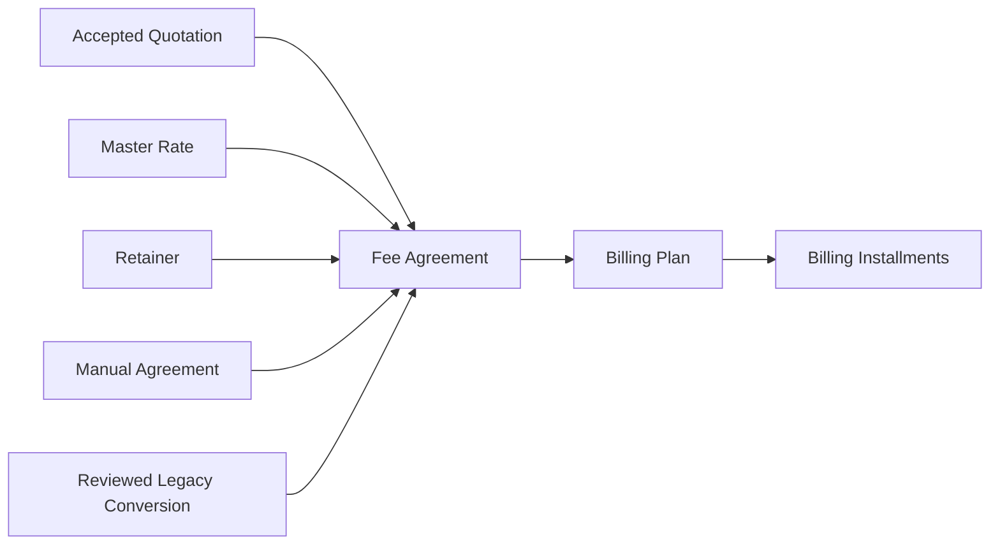
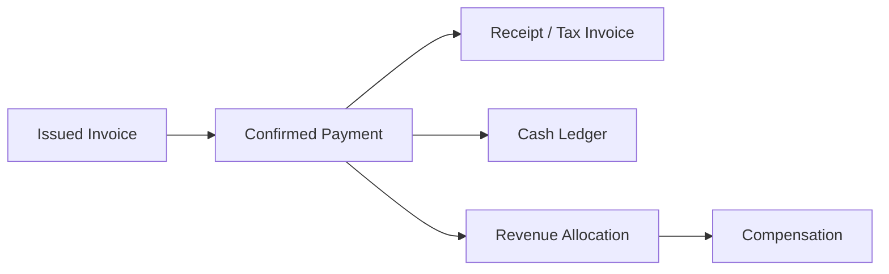

# VP Finance Data Flow & Source-of-Truth Specification

VP Office Operating System — Finance Architecture Standard v1

## 1. Purpose and Principles

This standard supports one-time quotations, accepted quotations, master-rate arrangements, manual agreements, retainers, mixed VAT/non-VAT work, installments, partial payments, WHT, receipts/tax invoices, cash ledger posting, and compensation from actual eligible professional fees.

1. A quotation is a source document, never an invoice.
2. An accepted quotation remains unchanged.
3. A Fee Agreement is the frozen commercial source of truth.
4. A Billing Plan controls when and how agreed fees become billable.
5. A Billing Installment is a schedule/readiness record, not a payment.
6. An Invoice is an amount demanded; a Payment is actual value received.
7. A Receipt is generated from a confirmed Payment, never merely from an Invoice.
8. Ledger records actual cash movement only.
9. VAT is never professional-fee income for compensation. WHT is a tax credit/receivable, not a discount.
10. Compensation uses actual received eligible professional fees only.
11. Historical documents render from frozen snapshots, not mutable settings.
12. Automation may create drafts/readiness; people issue, post, approve, cancel, and make legally significant decisions.

## 2. Canonical Flow

Client → Quotation or Master Rate / Retainer / Manual Agreement → Fee Agreement → Fee Agreement Items → Billing Plan → Billing Installments → Billing Installment Items → Invoice Draft → Issued Invoice → Payment → Receipt or Receipt/Tax Invoice → Ledger Posting → Revenue Allocation → Lawyer Compensation → Tax Center.

All entry paths converge into a Fee Agreement:

No path may convert legacy values automatically.

## 3. Entity Responsibilities

| Entity | Purpose / money meaning | Frozen point | Upstream / downstream | Client-facing / tax document |
|---|---|---|---|---|
| `finance_quotations`, items | Commercial offer; neither owed nor paid | accepted/cancelled | client/matter → agreement | client-facing; not tax |
| `finance_fee_agreements`, items | Frozen agreed commercial terms; neither owed nor paid | active | quotation/rate/retainer/manual → billing plan | internal commercial record |
| `finance_billing_plans` | Billable schedule control; neither owed nor paid | active | agreement → installments | internal |
| `finance_billing_installments`, items | Exact billable allocation/readiness; not payment | invoiced/cancelled | plan → invoice | internal |
| future invoices, items | Accounts receivable / amount demanded | issued/voided | installment → payment | client-facing financial document |
| future payments, allocations | Actual settlement value | confirmed/reversed | invoice → receipt/ledger/allocation | internal evidence record |
| future receipts | Evidence of confirmed payment | issued/voided/replaced | payment | client-facing legal/tax document |
| `finance_company_ledger` | Actual cash movement | posted/voided per existing model | confirmed payment/expense | internal actual ledger |
| future revenue allocations | Internal split of eligible received fee | approved | confirmed payment → compensation | internal |
| compensation batches/allocations | Lawyer payable record | existing lifecycle | approved allocation | internal payable |
| future VAT/WHT records | Tax liability / tax credit evidence | issued/confirmed | invoice/payment/receipt | tax control |

Commercial commitment, billing schedule, receivable, payment, tax evidence, cash ledger, internal allocation, and lawyer payable are separate concepts.

## 4. Source-of-Truth Matrix

| Data concept | Authoritative entity | Copied snapshot destinations | Editable until | Must never be recalculated from |
|---|---|---|---|---|
| Client identity/billing address | client at new-draft creation; document snapshot thereafter | quotation, agreement, invoice, receipt | respective draft/freeze point | current client after issue |
| Company identity | company profile at draft creation; snapshot thereafter | quotation/agreement/invoice/receipt | draft | current settings for old docs |
| Scope/included/excluded services | Agreement terms snapshot/items | billing plan, invoice | Agreement active | mutable quotation text |
| Fee description, quantity, unit price, VAT rule | Fee Agreement Items | installment items, invoice items | Agreement active | quotation rows after acceptance |
| Agreed total/billing method | Fee Agreement | plan snapshot | Agreement active | case fees/retainer legacy fields |
| Installment trigger/amount | Billing Plan/Installment Items | invoice draft | Plan active | invoice/payment values |
| Invoice amount | Invoice Items | receipt/payment allocation | Invoice issue | quotation/legacy paid amount |
| Payment date/cash/WHT | confirmed Payment | receipt, ledger, allocation | confirmation/reversal | invoice gross total |
| Receipt number | issued Receipt | tax reports | issue | invoice number |
| Ledger amount | Ledger posting from confirmed payment | reports | post/reversal | quotation/invoice issue |
| Allocation method/base | Agreement allocation snapshot; confirmed payment | compensation | Agreement active/payment confirmation | VAT-inclusive invoice total |

Invoice Items come from Billing Installment Items. Receipt comes from confirmed Payment. Ledger cash-in comes from confirmed cash. Compensation never uses invoice gross/VAT-inclusive total.

## 5. Snapshot Policy

- Quotation: company, client, matter, signer, terms, and items.
- Agreement activation: client/company/matter, commercial terms, source document, allocation policy.
- Invoice issue: seller tax identity, customer billing/tax identity, items, VAT, payment terms, agreement/installment references.
- Receipt issue: confirmed payment, tax identity, invoice links, WHT/certificate state.

Snapshots are append/freeze values, not live references. Current document settings may create a new draft only. Changing signer, address, tax ID, VAT configuration, or allocation formula must never rewrite historical output.

## 6. Lifecycle and Freeze Matrix

| Entity/status | Header/items editable | Allowed next action | Downstream creation | Confirmer |
|---|---|---|---|---|
| Quotation draft | yes | send/cancel | none | admin/partner |
| Quotation sent | no line edits | accept/cancel | agreement draft offer | admin/partner |
| Quotation accepted/cancelled | no | none | accepted may source agreement | authorized finance user |
| Agreement draft | yes | activate/cancel | none | admin/partner |
| Agreement active | no | complete/cancel | plan draft | admin/partner |
| Agreement completed/cancelled | no | none | no new normal schedule | authorized finance user |
| Plan draft | RPC-only edits | activate/cancel | none | admin/partner |
| Plan active | no | complete/cancel | readiness workflow | admin/partner |
| Plan completed/cancelled | no | none | no new schedule | authorized finance user |
| Installment pending | no direct edit after plan active | ready/cancel | none | admin/partner |
| Installment ready | no | reset/cancel; future invoice issue | Invoice Draft only | admin resets; finance issues |
| Installment invoiced/cancelled | no | Phase 4 reversal rules | payment for invoiced | controlled RPC |
| Future Invoice draft/issued/partially paid/paid/voided | draft only editable | issue/payment/void | payment | finance authority |
| Future Payment draft/confirmed/reversed | draft only editable | confirm/reverse | receipt/ledger/allocation | finance authority |
| Future Receipt draft/issued/voided-replaced | draft only editable | issue/controlled void | tax reporting | authorized issuer |

## 7. VAT and Non-VAT Flow

VAT is line-item data. Agreements, plans, installments, and invoices may mix VAT and non-VAT items. An Installment Item retains its Agreement Item tax nature; VAT must never detach from its taxable base.

Server validation uses source `vat_applicable` and `vat_rate`: earlier allocations use `round(before_tax × rate, 2)` and the final allocation receives the exact residual. All allocations must exactly equal the Agreement Item base, VAT, and total. VAT does not enter ledger revenue allocation or compensation.

Examples: professional legal fee subject to VAT; non-VAT professional fee; court/government charge; reimbursable expense; and pass-through disbursement require separate accountant-approved tax categories. VP's accountant must approve final tax-category and mixed VAT/non-VAT receipt rules before tax automation.

## 8. Billing Rules

- **Single:** one installment, all Agreement Items.
- **Installments:** two or more, unequal amounts allowed, exact item allocations required.
- **Milestone:** milestone may propose Ready to Invoice; it must not issue an Invoice.
- **Recurring:** period metadata and future duplicate-period prevention; intended for retainers.
- **Manual:** explicit readiness confirmation.

Plan activation validates the complete allocation. Ready to Invoice is workflow state only. An installment can be invoiced only by one controlled future invoice-generation event.

## 9. Phase 4 Invoice Contract

Invoice Draft requires Agreement, Plan, Installment, client/company/matter snapshots, exact copied installment items, before-VAT/VAT/total, dates, currency, and source references. One installment must not create duplicate active invoices. Invoice issue freezes its data and changes installment status only through a controlled RPC. Invoice issue never posts cash ledger.

Open design: numbering, number reservation, credit/debit notes, void rules, partial invoices (recommended default: no), due-date defaults, and customer tax-branch handling.

## 10. Payment, Receipt, WHT and Tax

Future flow: Issued Invoice → Payment recorded → Payment confirmed → allocation to invoices → Receipt Draft → Receipt or Receipt/Tax Invoice.

Payment captures date, method, bank account, gross settlement, cash received, WHT, evidence, payer, reference, and reversal state. Example: fee 100,000 + VAT 7,000; WHT 3,000; cash 104,000. Invoice settlement is 107,000; ledger cash is 104,000; WHT is a 3,000 tax-credit record; VAT liability is 7,000; eligible compensation base is 100,000 subject to policy. WHT base/rate must be configurable.

Document type must be accountant-approved for mixed items; never use one invoice-level boolean alone.

## 11. Ledger Contract

Ledger records actual cash only, after Payment confirmation. Do not post quotation, agreement, plan, or invoice issue. A post must reference payment, client, case/advisory when relevant, invoice, bank account, date, entry type, and source. Use unique payment linkage, idempotent RPC, and explicit void/reversal; WHT is separate from cash.

## 12. Revenue Allocation and Compensation

Confirmed Payment → Revenue Allocation Draft → admin review → approved allocation → lawyer payable/compensation.

Default base: actual received eligible professional fee **before VAT**. Exclude VAT, court/government fees, excluded reimbursements, and non-professional pass-throughs. WHT normally reduces cash, not earned professional-fee base, subject to approved accounting policy. Snapshot Pao Line, Tun Line, Source/Worker/QC, Custom, or No Allocation when Agreement activates. Partial payments allocate proportionally; a 50% payment of 100,000 eligible fee contributes 50,000 now.

## 13. Automation Boundaries

| Event | Automatic action | Human approval |
|---|---|---|
| Quotation accepted | offer Agreement Draft | confirm terms |
| Agreement active | offer Plan Draft | confirm schedule |
| date/milestone | propose Ready to Invoice | review readiness |
| Ready | generate Invoice Draft | issue Invoice |
| bank evidence | Payment Draft | confirm receipt |
| Payment confirmed | receipt/ledger/allocation drafts | issue/post/approve each |

Never fully automate tax-document issue, cash posting without confirmed receipt, compensation approval, snapshot mutation, or cancellation of issued tax documents.

## 14. Idempotency and Duplicate Protection

Required controls: one non-cancelled Agreement per quotation source; one non-cancelled Plan per Agreement; unique installment number per Plan; unique Agreement Item per Installment allocation; one active Invoice per Installment; one Ledger post per confirmed Payment; controlled receipt numbering; one active allocation source per payment/allocation; retry-safe RPCs.

## 15. Legacy Data Policy

- `cases.claim_amount`, `case_fee_items`, and `case_expense_items` are legacy/reference only.
- `case_fee_items.paid_amount` is not a Payment or Receipt.
- `advisory_matters.monthly_retainer_amount` is legacy retainer reference.
- `finance_company_ledger` is existing actual ledger.
- Existing compensation batches/allocations are legacy compensation records.

No automatic migration. Use reviewed manual conversion only, visually label legacy versus new documents, prevent double counting, and never infer a receipt from legacy paid amount without evidence.

## 16. Deployment Status and Order

Completed: Quotation foundation; Fee Agreement migration applied and committed.

Pending: `202607090010_create_finance_billing_plans.sql` exists locally and is not applied, committed, pushed, or deployed.

Next: review this standard; confirm VP decisions; apply and verify Billing Plan migration/RLS/RPCs; commit/push migration plus this specification; build Fee Agreement/Billing Plan UI; build accepted Quotation conversion; begin Phase 4 Invoice architecture. Rollback leaves unused additive structures in place rather than deleting production finance data.

## 17. Open VP Decisions

| Decision | Recommended default | Consequence if changed later |
|---|---|---|
| Replacement plans | allow only after old plan cancelled | requires explicit history/version policy |
| Cancel active plan pre-invoice | allow; block if invoiced | later credit-note policy required |
| Invoice per installment | exactly one | partial/multiple invoice model adds allocation complexity |
| Partial invoice | no | needs residual invoice controls |
| Compensation-eligible items | professional fees only | tax/category mapping required |
| WHT and compensation base | WHT does not reduce base | accounting policy may alter allocation reports |
| Court/pass-through treatment | separate reimbursement/payable policy | affects revenue/tax reporting |
| Single-plan trigger | agreement effective | different default affects readiness workflow |
| Recurring generation | controlled period generator | must add duplicate-period key |
| Mixed VAT receipts | accountant-approved policy | changes document issue behavior |
| Invoice/receipt issuer | designated finance authority | permission/RLS extension required |
| Ledger/allocation approver | admin/finance approval | separation-of-duties design required |

## 18. Assumptions and Scope

`finance_billing_*`, invoices, payments, receipts, revenue allocation, and tax-center tables are not all production tables today. This document specifies their future contracts only. It does not create Invoice, Payment, Receipt, Ledger, or Compensation behavior.
# Revenue Allocation Correction

Canonical flow: Quotation → Fee Agreement → Billing Plan → Installment → Invoice → Payment Confirmed → Receipt → Ledger Posting → Revenue Allocation Draft → Managing Partner Approval → Compensation. Fee Agreement activation does not require allocation; allocation is determined after actual payment.
