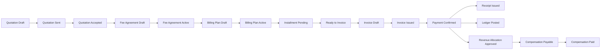
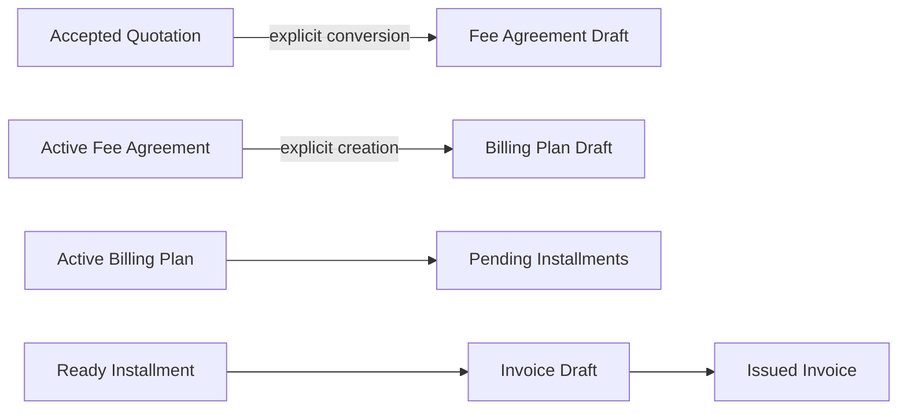
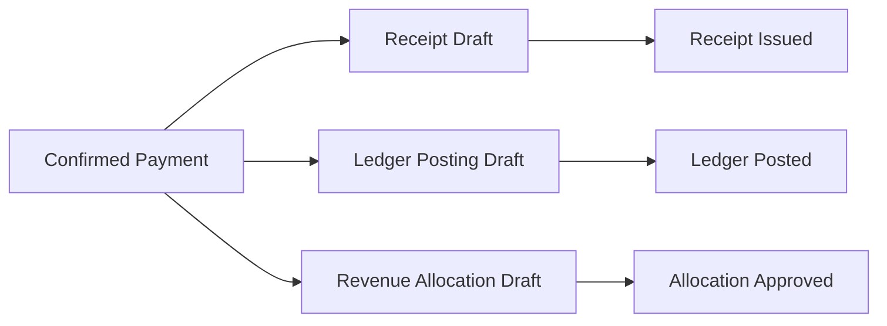
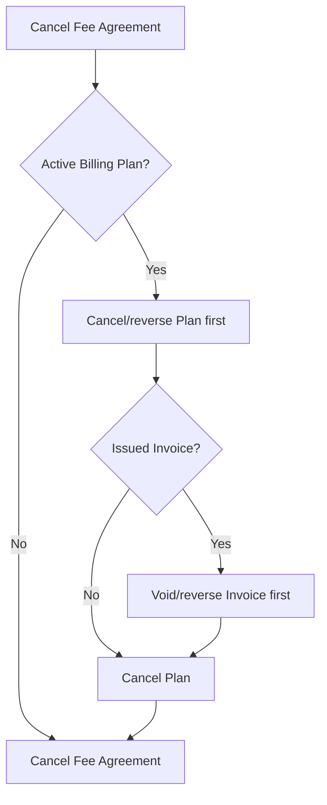

# VP Finance State Machine

> VP Office Operating System — Financial Lifecycle Standard v1

## 1. Core Principles

คำอธิบายนี้เป็นมาตรฐานกลางสำหรับ lifecycle การเงินของ VP และต้องใช้เป็นเกณฑ์ก่อนเพิ่ม Allocation, Activation, Invoice หรือการเชื่อมเงินสดจริง

1. Every lifecycle transition must be explicit.
2. Draft records may be edited only within defined boundaries.
3. Issued, activated, confirmed, posted, or approved records are not destructively edited.
4. Corrections after a freeze use cancellation, void, reversal, or replacement workflows.
5. Client-facing and tax documents use frozen snapshots.
6. A Quotation is not a receivable.
7. An Invoice is not payment.
8. A Payment is not a Receipt.
9. A Receipt is not Ledger posting.
10. Ledger records actual cash movement only.
11. Compensation derives from confirmed eligible receipts, not Invoice totals.
12. VAT never enters lawyer compensation.
13. WHT is not a discount.
14. Automation may prepare drafts or readiness states; people approve legal, tax, and cash actions.
15. No transition may silently create a downstream legally significant record.

## 2. Canonical State Flow

The following is a linked-entity flow, not one row changing through every label:

`Quotation Draft → Quotation Sent → Quotation Accepted → Fee Agreement Draft → Fee Agreement Active → Billing Plan Draft → Billing Plan Active → Installment Pending → Installment Ready to Invoice → Invoice Draft → Invoice Issued → Invoice Partially Paid/Paid → Payment Draft → Payment Confirmed → Receipt Draft → Receipt Issued → Ledger Posting Draft → Ledger Posted → Revenue Allocation Draft → Revenue Allocation Approved → Compensation Payable → Compensation Paid`

Each entity owns its own status, validation, audit trail, idempotency rule, and correction path.

## 3. Quotation State Machine

| Transition | Actor | Validation and freeze | Downstream permitted | Reversible? | Correction |
| --- | --- | --- | --- | --- | --- |
| `draft → sent` | Admin/Partner under current implementation | Required client, items, totals; line items freeze for this phase | Record delivery/acceptance later | No ordinary edit | Cancel and create replacement |
| `draft → cancelled` | Admin/Partner | Cancellation reason/audit when available | None | Terminal | New quotation |
| `sent → accepted` | Admin/Partner records acceptance | Accepted version and snapshots freeze | One non-cancelled Fee Agreement Draft may be created | No | Cancellation/replacement workflow |
| `sent → cancelled` | Admin/Partner | Cancellation reason/audit when available | None | Terminal | New quotation |

Disallowed: `accepted → draft`, `accepted → sent`, and `cancelled →` any active state.

An accepted Quotation is immutable. It may create one non-cancelled Fee Agreement Draft, but it does **not** create a Billing Plan, Invoice, Receipt, Ledger entry, or Compensation record.

## 4. Fee Agreement State Machine

Statuses: `draft`, `active`, `completed`, `cancelled`.

| Transition | Required condition | Effect | Correction |
| --- | --- | --- | --- |
| `draft → active` | See activation gate below | Metadata and Allocation Snapshot freeze; Billing Plan Draft may be offered | Variation/replacement, not direct mutation |
| `draft → cancelled` | Authorized decision | Stops work before activation | New agreement if needed |
| `active → completed` | All required plans and commercial obligations complete | Closes agreement operationally | Later controlled workflow only |
| `active → cancelled` | No incompatible downstream record, or children cancelled/reversed first | Stops future operation | Controlled cancellation/reversal chain |

### Draft Boundaries

Draft-editable fields: title, effective date, expiry date, billing method, allocation method/configuration, and internal administrative metadata.

Draft-immutable source fields: source Quotation, client, case/advisory matter, copied commercial terms, copied Fee Agreement Items, VAT treatment, accepted totals, and all source snapshots.

### Activation Gate

Before activation: valid client/source/matter; at least one item; reconciled totals; confirmed effective date; billing method; selected allocation method; valid allocation snapshot or explicit `no_allocation`; reviewed commercial terms.

Activation freezes Agreement metadata and Allocation Snapshot. It may allow Billing Plan Draft creation only; it must not create an Invoice, Ledger entry, or Compensation.

## 5. Allocation Configuration State

Allocation is currently a readiness concept, not a separate table lifecycle: `unconfigured → configured → frozen`.

| Method | Minimum configuration |
| --- | --- |
| `pao_line` | Frozen formula/version and eligible roles/percentages |
| `tun_line` | Frozen formula/version and eligible roles/percentages |
| `source_worker_qc` | Frozen source, worker, and QC definitions plus split rules |
| `custom` | Explicit recipients, percentages/amount rules, and validation |
| `no_allocation` | Explicit reason and acknowledgement that no compensation allocation is generated |

Order is mandatory: `Fee Agreement Draft → configure → validate → activate → freeze Allocation Snapshot`.

An Active Agreement must not receive first-time allocation configuration. Frozen snapshots never read newer global formulas; corrections need a controlled variation/replacement process.

## 6. Billing Plan State Machine

Statuses: `draft`, `active`, `completed`, `cancelled`.

| Transition | Gate | Effect |
| --- | --- | --- |
| `draft → active` | At least one installment; every installment has allocation items; all Agreement Items allocated exactly once in total; VAT/plan/installment totals reconcile; count and shape match method | Installment allocations freeze; installments become operational |
| `draft → cancelled` | Authorized cancellation | Plan stops before operation |
| `active → completed` | Every non-cancelled installment invoiced and obligations complete | Operational completion |
| `active → cancelled` | No invoiced installment, or Invoice is voided/reversed first | Pending/ready children are cancelled consistently |

Billing Plans are created only from an Active Fee Agreement. Draft child tables are replaced transactionally through RPC, not by direct child-table writes. Activation never automatically issues an Invoice.

## 7. Installment State Machine

Statuses: `pending`, `ready_to_invoice`, `invoiced`, `cancelled`.

| Phase | Allowed transitions |
| --- | --- |
| Phase 3C | `pending → ready_to_invoice`, `pending → cancelled`, `ready_to_invoice → pending`, `ready_to_invoice → cancelled` |
| Phase 4 | `ready_to_invoice → invoiced` under Invoice transaction |

The parent Plan must be Active before readiness. Ready to Invoice is not an Invoice. Reset is allowed only before issuance; invoiced and cancelled are terminal in ordinary operation. After invoice, correction uses Invoice void/cancellation rules.

| Trigger | Recommended VP automation |
| --- | --- |
| `agreement_effective` | System proposes; human confirms |
| `date` | System proposes; human confirms |
| `case_milestone` | System proposes after evidence; human confirms |
| `manual` | Human creates/confirms |
| `recurring_period` | System proposes; human confirms |

## 8. Future Invoice State Machine

Recommended minimum statuses: `draft`, `issued`, `partially_paid`, `paid`, `voided`, and optionally `cancelled` only where legally distinct from voided.

Allowed transitions: `draft → issued`, `draft → cancelled`, `issued → partially_paid`, `issued → paid`, `partially_paid → paid`, and `issued/partially_paid → voided` only through controlled checks.

One active Invoice per Installment is the default. Issuing freezes Invoice header/items, copies Billing Installment Items, and marks the Installment invoiced in one transaction. Issuance creates neither Payment, Receipt, nor Ledger posting. Phase 4 must resolve accountant-approved rules for cancellation versus voiding, credit notes, and debit notes.

## 9. Future Payment State Machine

Recommended statuses: `draft`, `confirmed`, `reversed`, with optional `cancelled` for unconfirmed drafts.

`draft → confirmed` requires verified bank/evidence, payment date, actual cash amount, WHT, payer/reference, and allocations within the permitted Invoice outstanding balance. A confirmed payment may prepare Receipt Draft, Ledger Posting Draft, and Revenue Allocation Draft; it approves none automatically.

Partial payments and one payment allocated across multiple invoices must use explicit payment-allocation rows. WHT is tracked separately and never silently reduces service value.

## 10. Future Receipt State Machine

Recommended statuses: `draft`, `issued`, `voided`, `replaced`.

Receipts are created from Confirmed Payment. Issue freezes tax/document snapshots and document number. There is no direct edit after issue; corrections use void/replacement. Receipt and Tax Invoice behavior requires accountant-approved policy.

## 11. Ledger State Machine

Recommended statuses: `draft`, `posted`, `voided/reversed`.

Ledger Posting is created only from Confirmed Payment for cash movement. One posted cash entry exists per Payment source; its amount equals actual cash received. WHT is separate. No Quotation, Agreement, Plan, or Invoice posts cash. Posted rows are never deleted; a correction is an explicit counter-entry or void/reversal record.

## 12. Revenue Allocation State Machine

Recommended statuses: `draft`, `approved`, `reversed`.

The source is Confirmed Payment or Payment Allocation. Use the frozen Fee Agreement Allocation Snapshot and actual received eligible professional fee before VAT; exclude VAT and non-eligible pass-through items. Partial receipts allocate proportionally. Approval creates Compensation Payables. No edit is allowed after approval except controlled reversal.

## 13. Compensation State Machine

Future lifecycle: `draft`, `approved`, `partially_paid`, `paid`, `reversed/cancelled`.

Existing `finance_compensation_batches` and `finance_compensation_allocations` are legacy/current records and must not be claimed to enforce this future lifecycle. Migration and integration are later work. Compensation must never be generated from unpaid Invoice totals or include VAT.

## 14. Cross-Entity Transition Matrix

| Source entity/state | User/System event | Target created/updated | Result state | Automatic? | Human approval | Transaction boundary | Idempotency key | Audit |
| --- | --- | --- | --- | --- | --- | --- | --- | --- |
| Quotation accepted | Create agreement | Fee Agreement | Draft | User initiated | Admin/Partner | Quote lock + agreement/items copy | Source quotation ID | Yes |
| Fee Agreement active | Offer/create plan | Billing Plan | Draft | Offer only | Admin/Partner | Agreement lock + plan/items | Agreement ID + active plan rule | Yes |
| Billing Plan active | Plan activation | Installments | Pending | Controlled state update | Admin/Partner | Plan + installments | Plan ID | Yes |
| Installment ready | Create invoice | Invoice | Draft | User initiated | Billing/Finance approver | Installment lock | Installment ID + active invoice rule | Yes |
| Invoice issued | Issue transaction | Installment | Invoiced | Controlled | Finance approver | Invoice + installment | Invoice ID | Yes |
| Payment confirmed | Prepare fan-out | Receipt/Ledger/Allocation | Drafts | Prepare only | Finance/Tax reviewer | Payment + allocations | Payment ID per target | Yes |
| Receipt draft | Issue receipt | Receipt | Issued | No | Accountant/Tax reviewer | Receipt lock | Receipt ID | Yes |
| Ledger draft | Post cash | Ledger | Posted | No | Finance approver | Ledger source lock | Payment ID | Yes |
| Allocation draft | Approve allocation | Compensation Payables | Draft | No | Finance approver | Allocation + payables | Payment allocation ID | Yes |
| Compensation payable | Record payment | Compensation | Paid | No | Finance approver | Compensation payment lock | Compensation payable ID | Yes |

## 15. Freeze Matrix

| Entity | Draft editable fields | Freeze event | Frozen fields | Correction method |
| --- | --- | --- | --- | --- |
| Quotation | Client/matter, dates, items, terms, signer | Sent/Accepted by current policy | Client-facing content and totals | Cancel and replace |
| Fee Agreement | Limited metadata and allocation config | Active | Metadata, allocation snapshot; source/items already immutable | Variation/replacement |
| Allocation Snapshot | Method/configuration | Agreement activation | Formula/version/recipients | Agreement variation/replacement |
| Billing Plan | Method, installments, allocation rows | Active | Plan and allocation shape | Cancel/recreate before Invoice |
| Installment allocations | Draft plan child rows | Plan activation | Allocation rows and totals | Plan cancellation/replacement |
| Invoice | Header/items | Issued | Document/tax values and number | Void/credit/debit policy |
| Payment | Evidence/allocation | Confirmed | Cash and allocation evidence | Controlled reversal |
| Receipt | Header/tax snapshot | Issued | Tax/document snapshot and number | Void/replacement |
| Ledger | Draft source values | Posted | Cash movement | Counter-entry/void |
| Revenue Allocation | Recipient allocation | Approved | Frozen source/amounts | Controlled reversal |
| Compensation | Payable/payment metadata | Approved/Paid | Approved/payable values | Reversal/cancellation |

## 16. Permission and Approval Matrix

Business roles below are future operating roles, not a claim that current technical roles map one-to-one. `Draft` = prepare, `Review` = inspect/validate, `Approve` = irreversible approval, `-` = not allowed.

| Action | Admin | Partner | Matter Owner | Billing Administrator | Finance Approver | Accountant/Tax Reviewer | System Automation |
| --- | --- | --- | --- | --- | --- | --- |
| Draft Quotation | Draft | Draft | Draft proposal | Draft | Review | - | - |
| Send Quotation | Approve | Approve | Review | Draft | Review | - | - |
| Accept/record acceptance | Approve | Approve | Review | - | Review | - | - |
| Create Fee Agreement | Draft | Draft | Review | Draft | Review | - | - |
| Configure Allocation | Draft | Draft | Review | - | Approve | - | - |
| Activate Fee Agreement | Approve | Approve | Review | - | Approve | - | - |
| Create/activate Billing Plan | Draft/Approve | Draft/Approve | Review | Draft | Approve | - | - |
| Mark Ready to Invoice | Approve | Approve | Review | Draft | Approve | - | Propose |
| Issue Invoice | Approve | Review | - | Draft | Approve | Review | - |
| Confirm Payment | Approve | Review | - | Draft | Approve | Review | - |
| Issue Receipt/Tax Invoice | Review | Review | - | Draft | Approve | Approve | - |
| Post Ledger | Review | Review | - | Draft | Approve | Review | - |
| Approve Allocation | Review | Review | - | - | Approve | - | - |
| Approve Compensation | Approve | Approve | - | - | Review | - | - |
| Record Compensation Paid | Approve | Review | - | Draft | Approve | - | - |
| Reverse a record | Approve | Review | - | Draft | Approve | Approve when tax-related | - |

## 17. Invalid States to Prevent

- Accepted Quotation with editable commercial items.
- Active Agreement with `allocation_method = null`.
- Active Agreement whose Allocation Snapshot changes with a global formula.
- Active Billing Plan with unallocated Agreement Items.
- Ready installment under a Draft Plan.
- Completed Plan with a pending installment.
- Invoice issued from a pending installment.
- Invoice directly posting a cash Ledger entry.
- Receipt issued from unconfirmed Payment.
- Ledger cash including WHT.
- Compensation including VAT or generated from an unpaid Invoice.
- Cancelled parent with active child records.
- Duplicate non-cancelled Agreement from one Quotation.
- Duplicate active Plan from one Agreement.
- Duplicate active Invoice from one Installment.
- Duplicate Ledger posting from one Payment.

## 18. Current Implementation Versus Future

### Implemented now

- Quotation lifecycle.
- Fee Agreement lifecycle foundation.
- Billing Plan lifecycle foundation.
- Installment readiness foundation.
- Accepted Quotation to Fee Agreement Draft conversion and local read/edit work currently uncommitted.

### Not implemented

- Allocation editor and snapshot validation.
- Fee Agreement activation UI.
- Invoice, Payment, Receipt, Ledger integration, Revenue Allocation, and new Compensation flow.
- Tax Center and automated milestone triggers.

Local uncommitted work is **not** a deployment claim.

## 19. Recommended Next Implementation Order

1. Phase 3D-C2 — Allocation configuration and snapshot validation.
2. Phase 3D-C3 — Fee Agreement activation gate/actions.
3. Phase 3D-C4 — Billing Plan creation/editor.
4. Stabilize and deploy the complete Phase 3D workflow.
5. Phase 4A — Invoice architecture/schema.
6. Phase 4B — Invoice Draft/Issue workflow.
7. Payment and Receipt.
8. Ledger and Revenue Allocation.
9. Compensation integration.
10. Tax Center and automation.

Allocation precedes Activation because activation freezes a financially material recipient/formula decision. Activating first would force either an unsafe mutable allocation or a later corrective variation.

## 20. Assumptions and Governance

### Revenue Allocation Correction

Fee Agreement activation does not require Revenue Allocation. Agreement-level allocation fields are legacy/optional hints only. Revenue Allocation is created per Confirmed Payment or Payment Allocation, approved by the Managing Partner, and only then freezes formula and recipients. Receipt and Ledger processes do not wait for allocation approval. VAT and excluded expenses never enter the compensation base; WHT remains subject to accounting policy.

- Current technical access is Admin/Partner for the implemented finance surfaces; future business roles require explicit permission design.
- Tax, receipt, void, credit-note, debit-note, WHT, and retention policy require accountant/legal approval before implementation.
- Every future RPC should enforce the relevant transition server-side, lock its source row(s), use a fixed `search_path`, derive the actor from authenticated identity, and produce audit data.
- Idempotency keys and source uniqueness constraints are required before any automated downstream creation.
